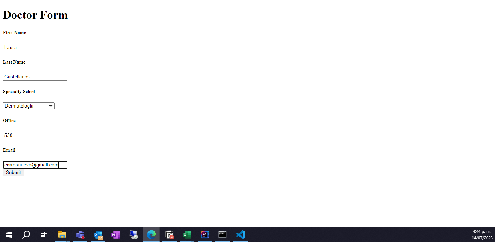
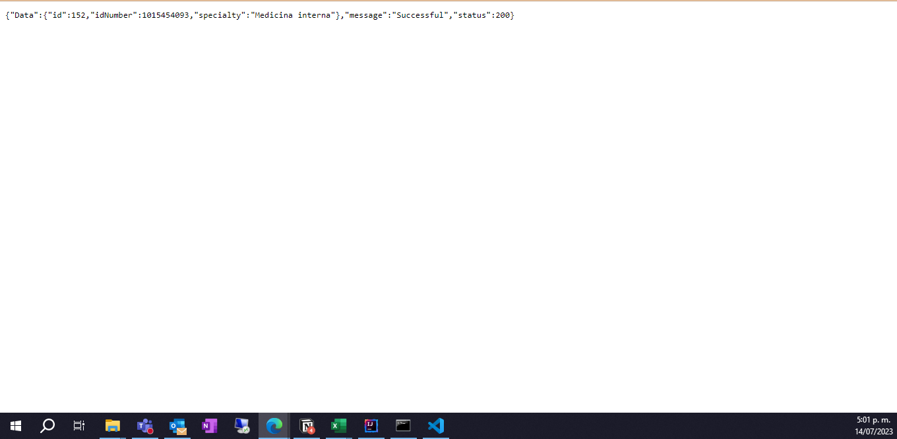

# Aplicación de citas
## Features
Aplicativo que ejecuta operaciones CRUD por medio de una APIREST básica. Permite realizar las siguientes acciones:
- Crear un doctor con una especialidad
- Crear un usuario 
- Crear una cita para un usuario específico y una especialidad existente de algún doctor
- Verificar todos los doctors disponibles
- Verificar todos los usuarios disponibles
- Verificar todas las citas disponibles
- Eliminar los doctores existentes
- Eliminar los usuarios existentes
- Eliminar las citas existentes

## Módelo de datos
En la siguiente imagen se observa el modelo de datos (diagrama) sobre el cual se crearon los modelos para las tablas 
de la base de datos relacional:


Se realiza un diagrama donde se visualizan las tablas creadas en la base de datos:

- Doctor
- User
- Appointment

## Tecnologías utilizadas
Se utilizaron las siguientes tecnologías:

- Spring Boot
- SQL

Se utilizaron los siguientes paquetes:

- thymeleaf
- jpa
- devtools
- mysql connector

## Orden del proyecto
Se crean las siguientes carpetas (con una breve explicación de su contenido)

- controller -> Archivos que realizan el manejo de las peticiones HTTP
- models -> Creación de los modelos que representaran las tablas en la base de datos
- repository -> Creación de archivos que enlazan los modelos con CrudRepository
- services -> Creación de los archivos que manejan la lógica del negocio de las peticiones HTTP.

## Instalación
1. Clonar el repositorio con el siguiente comando

```
git clone https://github.com/jucramirezay/doctor_appointments_java.git
cd doctor_appointments_java
```

2. Una vez clonado validar que se tiene instalado Java en el equipo con el comando

```
java --version
javac --version
```

3. Por medio de un IDE, como por ejemplo IntelliJ IDEA realizar la ejecución del proyecto descargado de GIT. Ejecutar el archivo AppointmentsApplication

4. Abrir el explorador en la ruta https://127.0.0.1:8080

El archivo application.properties debe ser creado para que la API funcione, en tal caso se deben agregar los datos referentes a la base de datos

- spring.datasource.url (URL de la base de datos)
- spring.datasource.username (Usuario de la base de datos)
- spring.datasource.password (Contraseña de la base de datos)
- spring.datasource.driverClassName (Driver utilizado en la base de datos)
- server.port (Puerto donde se va a escuchar la aplicación, por defecto 8080)

## Documentacion 
En las siguientes líneas se mostrara de forma breve el funcionamiento de la API

### Crear un nuevo doctor
Formulario para la creación de un Doctor



Creacion exitosa del doctor


Se crea otro doctor y se valida en la lista los doctores creados


### Crear un nuevo usuario
ormulario para la creación de un usuario


Creación exitosa del usuario


Se crea otro usuario y se valida en la lista los usuarios creados


### Crear una nueva cita
Formulario para la creación de una cita


Creación exitosa de la cita



Se crea una nueva cita y se valida en la lista las citas creadas


### Eliminar un doctor
Se puede eliminar un doctor por medio del botón "delete" que se encuentra en la lista de todos los doctores


Se va a eliminar el doctor que tiene la especialidad Medicina General


### Eliminar un usuario
Se puede eliminar un usuario por medio del botón "delete" que se encuentra en la lista de todos los usuarios


Se va a eliminar el usuario con documento 1015454093


### Eliminar una cita
Se puede eliminar una cita por medio del botón "delete" que se encuentra en la lista de todas las citas


Se va a eliminar la cita que tiene la especialidad Radiología


## End Points
### Doctor
- /allDoctors (Obtener la lista de todos los doctores)
- /doctors/{id} (Obtener un solo doctor por id)
- /newDoctor (Get que trae el formulario para crear un nuevo doctor)
- /newDoctor (Crea un nuevo doctor)
- /deleteDoctor/{id} (Elimina el doctor indicado por el id)

### User
- /allUsers (Obtener la lista de todos los usuarios)
- /users/{id} (Obtener un solo usuario por id)
- /newUser (Get que trae el usuario)
- /deleteUser/{id} (Elimina el usuario indicado por el id)


### Citas
- /allAppointments (Obtener la lista de todos los appointments)
- /appointments/{id} (Obtener un solo appointment por id)
- /newAppointment (Get que trae el formulario para crear un nuevo appointment)
- /newAppointment (Crea un nuevo appointment)
- /deleteAppointment/{id} (Elimina el appointment indicado por el id)

## Información Personal
Creador: Juan Camilo Ramírez 
Licencia: MIT License 
Curso: ATENEA - Universidad Distrital - Todos a la U 
Fecha realización: 12/07/2023

